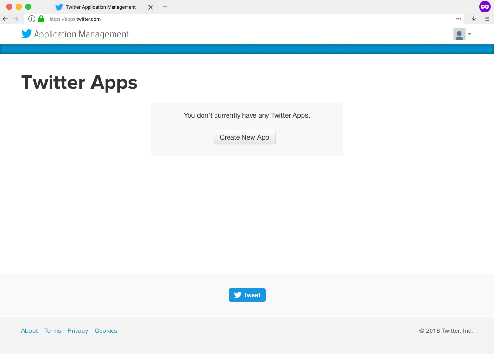
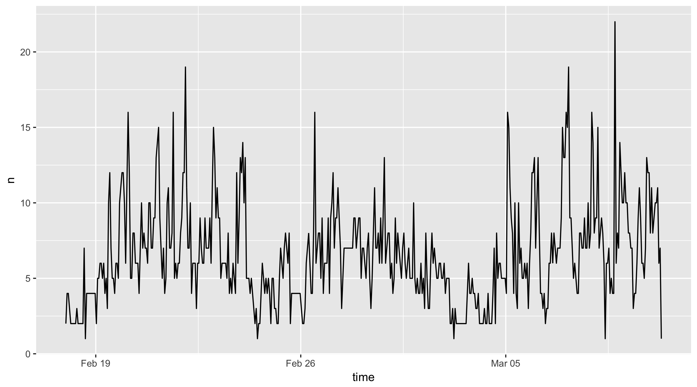
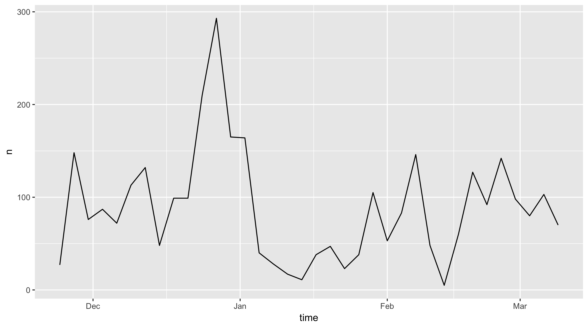
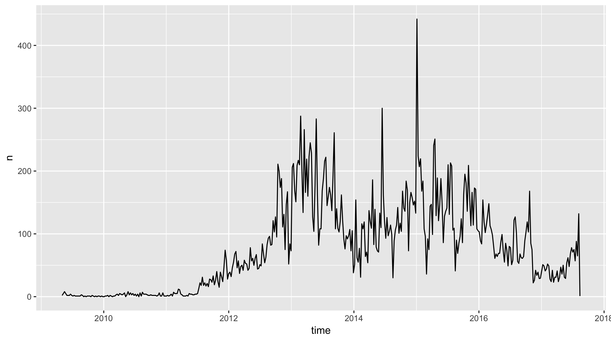

```{r setup, include=FALSE}
knitr::opts_chunk$set(echo = TRUE, eval = FALSE,
  collapse = TRUE, comment = "#>")
options(htmltools.dir.version = FALSE)
htmltools::tagList(rmarkdown::html_dependency_font_awesome())
library(tidyverse)
library(rtweet)
DT <- function(x) {
  x <- head(x, 6)
  knitr::kable(x, format = "html")
}
```

background-image: url(img/logo.svg)
class: center, bottom

View these slides at [mkearney.github.io/nicar_tworkshop](https://mkearney.github.io/nicar_tworkshop)

Follow along with the companion [script.R](../script.R) file on Github ([github.com/mkearney/nicar_tworkshop](https://github.com/mkearney/nicar_tworkshop))

---
class: center, middle


<br \>

<br \>

<br \>

<br \>


# rtweet

### /ärtwēt/


<br \>

<br \>

<br \>

<br \>


See **{rtweet}** in action, [tracking tweets about \#NICAR18](https://github.com/computer-assisted-reporting/NICAR18)


---

# About {rtweet}

- On the Comprehensive R Archive Network

[](https://opensource.org/licenses/MIT)[](https://cran.r-project.org/package=rtweet)

- Growing base of users

[](http://depsy.org/package/r/rtweet)

- Fairly stable

[](https://travis-ci.org/mkearney/rtweet)[](https://codecov.io/gh/mkearney/rtweet?branch=master)[](https://www.tidyverse.org/lifecycle/#maturing)

- Package website: [rtweet.info](http://rtweet.info)

[](http://rtweet.info/)

- Github repo: [mkearney/rtweet](https://github.com/mkearney/rtweet)

[](https://github.com/mkearney/rtweet/)[](https://github.com/mkearney/rtweet/)

---

# Install

- Install **{rtweet}** [CRAN](https://cran.r-project/package=rtweet).

```{r tidy=FALSE}
install.packages("rtweet")
```

- Or install the **development version** from [Github](https://github.com/mkearney/rtweet).

```{r tidy=FALSE}
devtools::install_github("mkearney/rtweet")
```

- Load **{rtweet}**

```{r tidy=FALSE}
library(rtweet)
```


---
class: inverse, center, middle

# Accessing web APIs

---

# Some background

 **Application Program Interfaces** (APIs) are sets of protocols that govern interactions between sites and users.

APIs are similar to web browsers but with different purpose:
- Web browsers **render** content
- Web APIs manage and organize **data**


For public APIs, many sites only allow **authorized** users
- Twitter, Facebook, Instagram, Github, etc.

---

# Twitter APIs

To connect to Twitter's APIs, users need a **consumer key** and **consumer secret**, which you can get by creating a Twitter app. 

View the built-in vignette **`auth`** for instructions on obtaining and storing user access tokens.<sup>\* </sup>

```{r}
## view rtweet's authorization vignette
vignette("auth", package = "rtweet")
```

Or look up the vignette online: [rtweet.info/articles/auth.html](http://rtweet.info/articles/auth.html)

.footnote[
<sup> \* </sup> For a while, rtweet users were not required to create their own Twitter applications. [That recently changed](https://github.com/mkearney/rtweet/issues/179#issuecomment-365689068), but hopefully it's resolved soon.
]

---
class: inverse, center, middle

# Creating a Twitter App

---

# Create a Twitter App

<span>1.</span> Log in to your [Twitter.com](https://twitter.com) account

<span>2.</span> Go to [apps.twitter.com](https://apps.twitter.com/) and select **Create New App**

<span style="margin-left:15%"></span>

---

<span>3.</span> Complete the fields (**important**: Callback URL must be exact)
  - Name: `{{initials}}_twitter_app`
  - Description: `{{something about analyzing Twitter data}}`
  - Website: `https://twitter.com/{{you_screen_name}}`
  - **Callback URL:** `http://127.0.0.1:1410`

<span style="margin-left:15%"></span>

<span>4.</span> Store name of app as `app_name` in R script

```{r}
## name of twitter app
app_name <- "mwk_twitter_app"
```

---

# Copy the keys

<span>5.</span> Click **Create your Twitter application**

<span>6.</span> Select **Keys and Access Tokens** tab

<span>7.</span> Copy the **Consumer Key (API Key)** and **Consumer Secret (API Secret)** and paste into R script

<span style="margin-left:15%"></span>

```{r}
## copy and pasted *your* keys (these are fake)
consumer_key <- "XYznzPFOFZR2a39FwWKN1Jp41"
consumer_secret <- "CtkGEWmSevZqJuKl6HHrBxbCybxI1xGLqrD5ynPd9jG0SoHZbD"
```

---

# Create a token

<span>8.</span> Pass the stored values to `create_token()` to create the Twitter authorization token.

```{r}
## create token
token <- create_token(app_name, consumer_key, consumer_secret)

## print token
token
```


---

# Storing Your Token

Every request sent to Twitter must include a token. Save yourself trouble by storing it as an environment variable.

```{r}
## save token to home directory
path_to_token <- file.path(path.expand("~"), ".twitter_token.rds")
saveRDS(token, path_to_token)

## create env variable TWITTER_PAT (with path to saved token)
env_var <- paste0("TWITTER_PAT=", path_to_token)

## save as .Renviron file (or append if the file already exists)
cat(env_var, file = file.path(path.expand("~"), ".Renviron"), 
  fill = TRUE, append = TRUE)
```

Normally `.Renviron` is processed on start-up, so refresh it.

```{r}
## refresh .Renviron variables
readRenviron("~/.Renviron")
```

---
class: inverse, center, middle

# Twitter Data!


---
class: inverse, center, middle

# 1. <br /> Getting friends/followers


---


# Friends/followers

Twitter's API documentation distinguishes between **friends** and **followers**.

- **Friend** refers to an account a given user follows
 
- **Follower** refers to an account following a given user

---

# `get_friends()`

Get the list of accounts **followed by** @jack (co-founder and CEO of Twitter).

```{r}
## get status IDs of jack's friend's
fds <- get_friends("jack")
```

Get friends of **multiple** users in a single call.

```{r}
## get friends of multiple accounts
fds <- get_friends(c("hadleywickham", "NateSilver538", "Nate_Cohn"))
fds
```

```{r, eval=TRUE, echo=FALSE}
fds <- get_friends(c("hadleywickham", "NateSilver538", "Nate_Cohn"),
  verbose = FALSE)
DT(fds)
```

---

# `get_followers()`

Get the user IDs of accounts **following** a user with `get_followers()`.

```{r}
kmw <- get_followers("kearneymw")
kmw
```

Unlike friends (limited by Twitter to 5,000), there is **no** limit on the number of followers. 

To get user IDs of all 48.8 million followers of @realDonaldTrump, you only need two things:

1. A stable **internet** connection 
2. **Time** – approximately five and a half days

```{r}
## get all of trump's followers
rdt <- get_followers("realdonaldtrump", n = 5e7, retryonratelimit = TRUE)
```


---
class: inverse, center, middle

# 2. <br /> Searching for tweets

---

# `search_tweets()`

Search for Twitter statuses containing a **keyword**, **phrase**, or **multiple keywords**.

```{r}
## search for a keyword
rt <- search_tweets(q = "rstats")

## search for a phrase
rt <- search_tweets(q = "data science")

## search for multiple keywords
rt <- search_tweets(q = "rstats AND python")
```

By default, `search_tweets()` returns **100** tweets. To return more (rate limit is 18,000 per 15 minutes), set `n` to a higher number.

```{r}
## search tweets (q = search query; n = desired number of tweets to return)
rt <- search_tweets(q = "rstats", n = 1000)
```

---

# `search_tweets()`

Use ` OR ` between search terms to find **any match**.

```{r}
## search for any mention of a list of words
rt <- search_tweets("statistics OR statistical OR quantitative")
```

Specify a **language** of the tweets and **exclude retweets**.

```{r}
## search for tweets in english that are not retweets
rt <- search_tweets("rstats", lang = "en", include_rts = FALSE)
```

Search by **geo-location**.

```{r}
## search for tweets in english that are not retweets
rt <- search_tweets("lang:en", geocode = lookup_coords("Chicago, IL"))
```

---

# `search_tweets()`

Search by **source** of a tweet (e.g., only tweets sent using `ifttt`<sup> \* </sup>).

```{r}
## search for english tweets sent via ifttt
rt <- search_tweets("lang:en source:ifttt", n = 300)
table(rt$source)
```


```{r, eval=TRUE, echo=FALSE}
## search for english tweets sent via ifttt
rt <- search_tweets("lang:en source:ifttt", verbose = FALSE)
DT(tibble::as_tibble(sort(table(source = rt$source), decreasing = TRUE)[1:5]))
```


.footnote[
<sup> \* </sup> The results may look strange, but that's because it's matching the original source of a tweet, but it's returning the source of retweets. In other words, that's why not everyone used `ifttt`.
]


---
class: inverse, center, middle

# 3. <br /> User timelines

---

# `get_timeline()`

Provide a **user ID** or **screen name** and specify the **number** of tweets (max of 3,200).

```{r}
cnn <- get_timeline("cnn", n = 3200)
ts_plot(cnn, "hours")
```

<span style="margin-left:1%"></span>


---

# `get_favorites()`

Provide a **user ID** or **screen name** and specify the **number** of tweets (max of **3,000**).

```{r}
kmw_favs <- get_favorites("kearneymw", n = 3000)
ts_plot(kmw_favs, "3 days")
```

<span style="margin-left:1%"></span>


---
class: inverse, center, middle

# 4. <br /> Lookup functions

---

# `lookup_tweets()`

Get tweets data for four of Trump's controversial tweets by looking up their **status IDs**.

```{r}
## status IDs
status_ids <- c("947235015343202304", "947592785519173637", 
  "948359545767841792", "832945737625387008")

## lookup tweets
twt <- lookup_tweets(status_ids)
```


---

# `lookup_users()`

Use **screen names** or **user IDs** to fetch users data. 

```{r}
## screen names
users <- c("hadleywickham", "NateSilver538", "Nate_Cohn")

## lookup users
usr <- lookup_users(users)
```


---
class: inverse, center, middle


# 5. <br /> Live stream


---

# `stream_tweets()`

Capture tweets in real time via...

- "Random" **sample**

```{r}
## random sample
st <- stream_tweets(q = "", timeout = 30)
```

- **Filter** by keyword

```{r}
## keyword filter
st <- stream_tweets(q = "realDonaldTrump,Mueller", timeout = 30)
```

- **Locate** by bounding box

```{r}
## geo location
st <- stream_tweets(q = lookup_coords("London, GB"), timeout = 30)
```


---
class: inverse, center, middle

# Honorable mentions


---

# Other data functions

- `search_users()`
- `lookup_users()`
- `get_trends()`
- `stream_tweets()`
- `lists_members()`
- `lists_statuses()`

---

# Other utility functions

- `lookup_coords()`
- `tweet_shot()`
- `post_*()`
- `ts_data()`
- `lat_lng()`
- `emojis`
- `stopwordslangs`

---
class: inverse, center, middle

# Neat Applications

---

# Network analysis

Objects returned by `get_friends()` and `get_followers()` are great for network analysis. Example:

```{r}
## get friends of multiple accounts
fds <- get_friends(c("hadleywickham", "NateSilver538", "Nate_Cohn"))

## frequency count of accounts followed by the users queried above
tbl <- table(fds$user_id)

## subset fds data to only those followed by 3 or more
fds3 <- subset(fds, user_id %in% names(tbl[tbl > 2L]))

## convert fds3 to matrix
mat <- as.matrix(fds3)

## convert to graph object
mat <- igraph::graph_from_edgelist(mat)

## plot network
plot(mat)
```

---
background-image: url(img/rstudio_network.png)
background-position: 50% 50%
class: center, bottom, inverse


---

# Firehose for free

It's possible to use multiple keywords to find **any** match.

It's possible to search for tweets in a **language**.

Twitter **supports** 34 languages.

```{r}
## vector of all supported language abbreviations
langs <- c("en", "ar", "bn", "cs", "da", "de", "el", "es", "fa", "fi", "fil", 
  "fr", "he", "hi", "hu", "id", "it", "ja", "ko", "msa", "nl", "no", "pl", 
  "pt", "ro", "ru", "sv", "th", "tr", "uk", "ur", "vi", "zh-cn", "zh-tw")

## add param name (lang) to each
langs <- paste0("lang:", langs)

## collapse into single OR search
langs <- paste(langs, collapse = " OR ")

## search for most recent 6,000 tweets in any language
rt <- search_tweets(langs, n = 6000)
```

---

# {botornot}

Machine learning model trained on data set containing over 7,000 known bot (automated) accounts. When applied to test data, the model was 95% accurate at classifying bots versus non-bots.

- Package repo: [github.com/mkearney/botornot/](https://github.com/mkearney/botornot)
- The Shiny app: [mikewk.shinyapps.io/botornot/](https://mikewk.shinyapps.io/botornot/)


---
class: inverse, center, middle

# Data: Trump tweets

---

# Trump tweets

Read in data set of @realDonaldTrump tweets and plot time series.

```{r}
## read in data
tt <- readRDS("rtweet-trumpdata.rds")

## quick time series
ts_plot(tt, "weeks")
```


<span style="margin-left:10%"></span>


---

# Sentiment analysis

Define some functions and then calculate sentiment by time interval.

```{r}
## function to round time (created_at)
round_time <- function(x, secs) as.POSIXct(hms::round_hms(x, secs))
## function to calculate sentiment scores
sent_scores <- function(x) syuzhet::get_sentiment(plain_tweets(x)) - .5

## calc data set with sentiment variable
tt_sent <- tt %>%
  mutate(days = round_time(created_at, 60 * 60 * 24),
    sentiment = sent_scores(text))

## aggregate by rounded time interval
tt_sent  %>% 
  group_by(days) %>%
  summarise(sentiment = sum(sentiment, na.rm = TRUE)) %>%
  ggplot(aes(x = weeks, y = sentiment)) +
  geom_point(aes(colour = sentiment > 0)) + 
  geom_smooth(method = "loess", span = .2) + 
  scale_color_manual(values = c("#dd3333", "#22aa33")) + 
  geom_hline(yintercept = 0, linetype = 2, colour = "#000000cc") + 
  theme_minimal(base_family = "Helvetica Neue")
```

---

# Now on CRAN

The **{textfeatures}** package.

```{r}
## aggregate text features by the hour
tt_tft <- tt %>% 
  filter(created_at > "2010-12-31") %>%
  mutate(hours = round_time(created_at, 60 * 60)) %>%
  group_by(hours) %>%
  textfeatures::textfeatures() %>%
  print()
```


```{r, eval=TRUE, echo=FALSE}
tt_tft <- readRDS("data/tt_tft.rds")
DT(tt_tft[, 1:5])
```

---

# Plot change in text features over time

```{r}
## plot [smoothing] text features over time
tt_tft %>%
  filter(hours > "2014-05-31") %>%
  mutate_if(is.numeric, function(x) scale(x)[, 1]) %>%
  gather(feature, n, -hours) %>%
  ggplot(aes(x = hours, y = n, colour = feature)) + 
  geom_vline(xintercept = as.POSIXct("2016-11-08"),
    colour = "#aa000077", size = .9, linetype = 2) +
  geom_smooth(method = "loess", span = .1) + 
  facet_wrap(~ feature, ncol = 6)
```

---

<br />

<span style="margin-left:0%"></span>

---

<br />

<span style="margin-left:0%"></span>

```{r, echo=FALSE}
tt_tft %>%
  filter(hours > "2016-04-30" & hours < "2017-02-01") %>%
  mutate_if(is.numeric, function(x) scale(x)[, 1]) %>%
  gather(feature, n, -hours) %>%
  ggplot(aes(x = hours, y = n, colour = feature)) + 
  geom_vline(xintercept = as.POSIXct("2016-11-08"),
    colour = "#aa000077", size = .9, linetype = 2) +
  geom_smooth(method = "loess", span = .225) + 
  facet_wrap(~ feature, ncol = 6) + 
  labs(title = "Text features of @realDonaldTrump tweets in closing months of 2016",
    x = NULL, y = "Standardized Mean Frequencies") + 
  scale_x_datetime(date_breaks = "months", 
    date_labels = "%b") + 
  theme_mwk(base_family = "Roboto Condensed", base_size = 15, 
    light = "#f7f7f7", gray = "#e0e0e0") + 
  theme(
    axis.text = element_text(size = rel(.68)),
    strip.text = element_text(size = rel(.75)),
    strip.text.x = element_text(margin = margin(5, 3, 6, 3, "pt")),
    panel.grid.major = element_line(colour = "black", size = rel(.10)),
    panel.grid.minor = element_line(colour = "black", size = rel(.05)),
    legend.position = "none") + 
  coord_cartesian(xlim = c(lubridate::ymd_h("2016-06-30 0"),
    lubridate::ymd_h("2016-12-31 24")), ylim = c(-.7, .8)) + 
  ggsave("~/Desktop/trumptextfeatures-zoom.png")
```

---
class: inverse, center, middle

# The end

